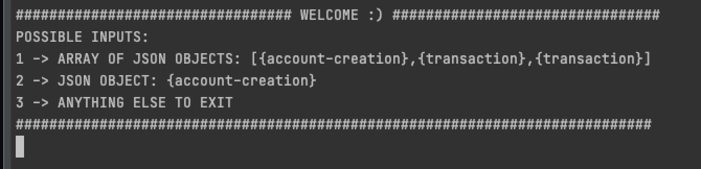
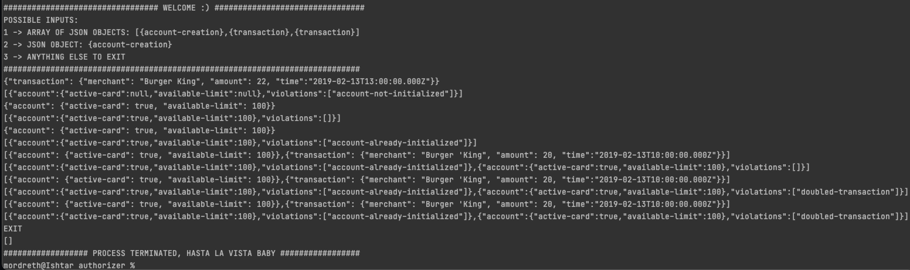

# AUTHORIZER -> STANDALONE

### Description

Hello there 

this is a side project to use concepts of functional programming in java 8. 

I intended here to implement a maintainable, extensible and elegant source code while following the principles of hexagonal architecture.

I use a functional programming approach to delegate responsibilities and perform operations. 

### Application Structure

| Directory | Purpose |
| ------ | ------ |
| constant | Application constants values that does not change |
| delegate | Classes that delegate to services |
| dto | Data Transfer Objects (DTOs) |
| exception | Custom Exceptions created for the sake of error Management |
| mapper | Mapper classes to perform object transform operations |
| persistence | Entities and repositories to store the data (implemented in explicit Lists) |
| service | Classes that perform business logic |


### Instructions 

In your terminal, go to the root folder of this app and execute the following commands (you may want to have docker installed)

```sh
docker build -t standalone/authorizer .
docker run -it standalone/authorizer 
```

Then you will see something like this:



Finally, you just follow the instruction and use the application. 

Important note > there is three possible ways to send request in stdin:

A JSON Array of objects
```sh
[{"account": {"active-card": true, "available-limit": 100}},{"transaction": {"merchant": "Burger 'King", "amount": 20, "time":"2019-02-13T10:00:00.000Z"}}]
```

A Single JSON Object 
```sh
{"transaction": {"merchant": "Burger King", "amount": 22, "time":"2019-02-13T13:00:00.000Z"}}
```

ANYTHING ELSE EXIT
```sh
EXIT
```

You should expect to have a behaviour like this:



### Relevant third party packages

| Package | Purpose | URL |
| ------ | ------ | ------ |
| Jackson[databin/core/annotations/datatype] | Serialize/deserialize Json objects | https://github.com/FasterXML/jackson |
| io.vavr | Functional library for Java 8+ that provides persistent data types and functional control structures.  | https://www.vavr.io |
| lombok | Annotation support to avoid boilerplate code | https://projectlombok.org |  
| mockito | Utility library for Mock creation in test cases | https://site.mockito.org |

